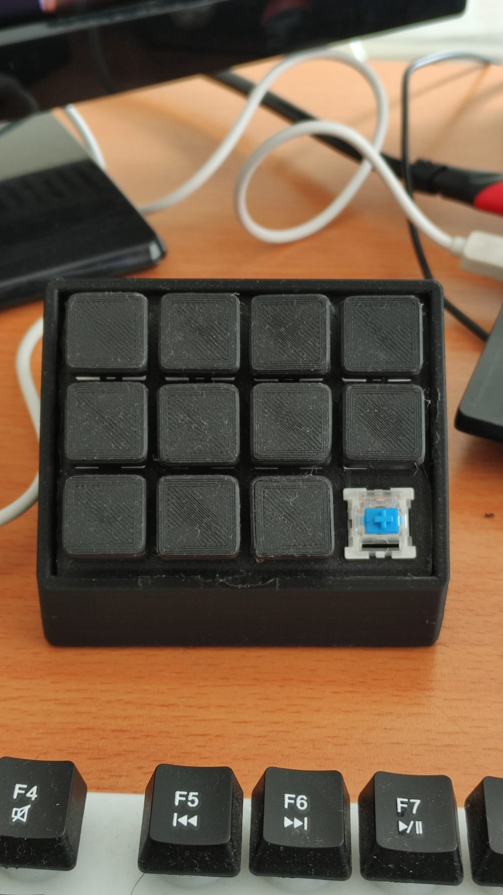
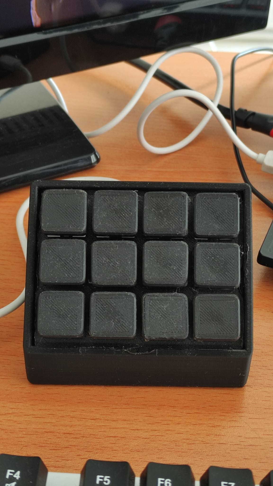

# YazilimciKalvyesi_MakroKeyboard
Üniversite bitirme projesi olarak yaptığım bu çalışma temelde bir windows uygulaması ile bir donanım olan arduino pro micro'yu kontrol etme üzerine kurulmuş bir proje.
***
## Resimler:

***
Youtube Linki: Yakında!!
